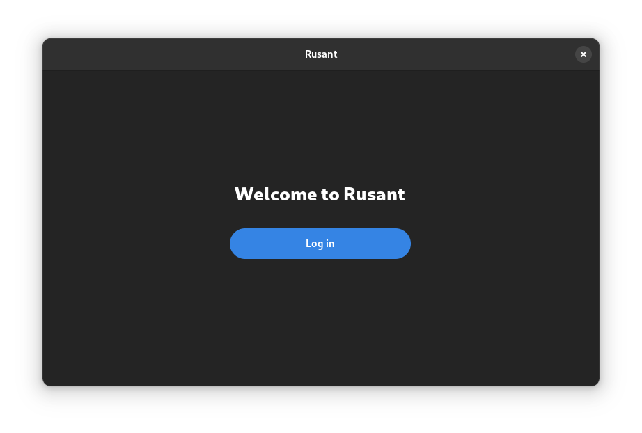
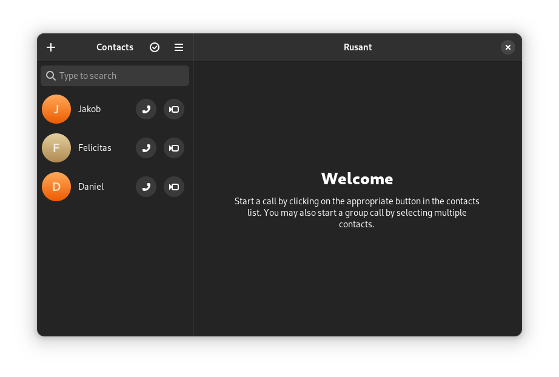

# rusant


Open source video conferencing platform.

## Overview


Rusant is an open-source video conferencing platform written using Rust, GTK4 and libadwaita. Rusant utilizes GStreamer pipelines in order to transmit video and audio data. Rusant also includes the `saltpanelo-sys` library, which provides bindings to Rusant's networking layer. The networking layer called [Saltpanelo](https://github.com/pojntfx/saltpanelo) is written in Go which is the primary reasons bindings are required.

## Getting started





Running while the shared library example is in place requires setting the `LD_LIBRARY_PATH`:

```
 env LD_LIBRARY_PATH=rusant-shared/cproject cargo r
```

## Contributing

1. Fork it
2. Create your feature branch (`git checkout -b my-new-feature`)
3. Commit your changes (`git commit -am "feat: Add something"`)
4. Push to the branch (`git push origin my-new-feature`)
5. Create Pull Request

## License

rusant (c) 2023 Jakob Waibel and contributors

SPDX-License-Identifier: AGPL-3.0License
